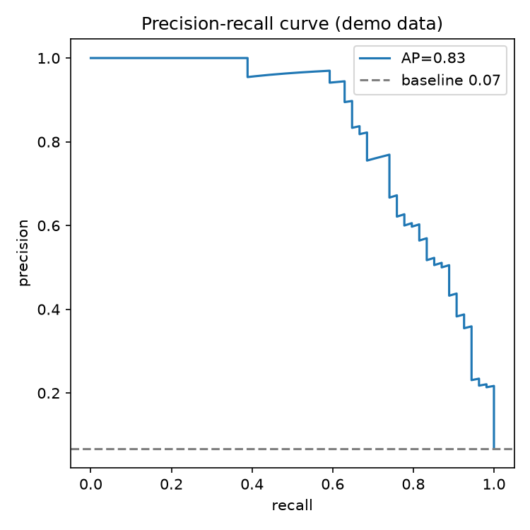

# Precision Recall Curve

When only 8% of your samples are positive, a 95%-accurate model can be useless. The precision-recall curve is the metric that refuses to let you fool yourself.

## Why This Matters

Biology is full of rare-positive problems: pathogenic variants, responders, disease cases. On imbalanced data, accuracy and even ROC-AUC look flattering while the model misses almost everything that matters. Precision-recall focuses only on the positive class, so a good-looking curve actually means a useful model.

## How It Works

1. Score each test sample.
2. Sweep the decision threshold, recording precision and recall.
3. Plot precision against recall, versus the positive-rate baseline.

## What the Demo Shows



The demo trains on data with only 8% positives. The curve sits well above the dashed baseline (the prevalence) — the honest signal that the model has genuine skill on the rare class, not just high accuracy from predicting 'negative'.

## Run It

```bash
pip install -r requirements.txt
python demo.py
```

> Demonstrated on synthetic data, so it's fully reproducible with no external downloads.
